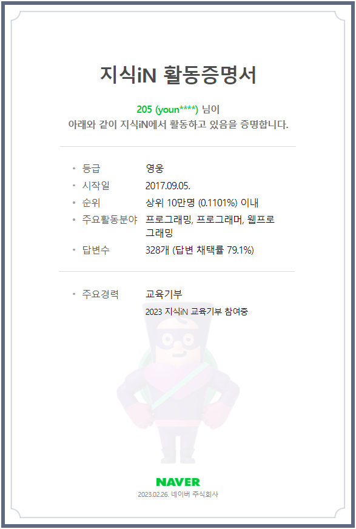
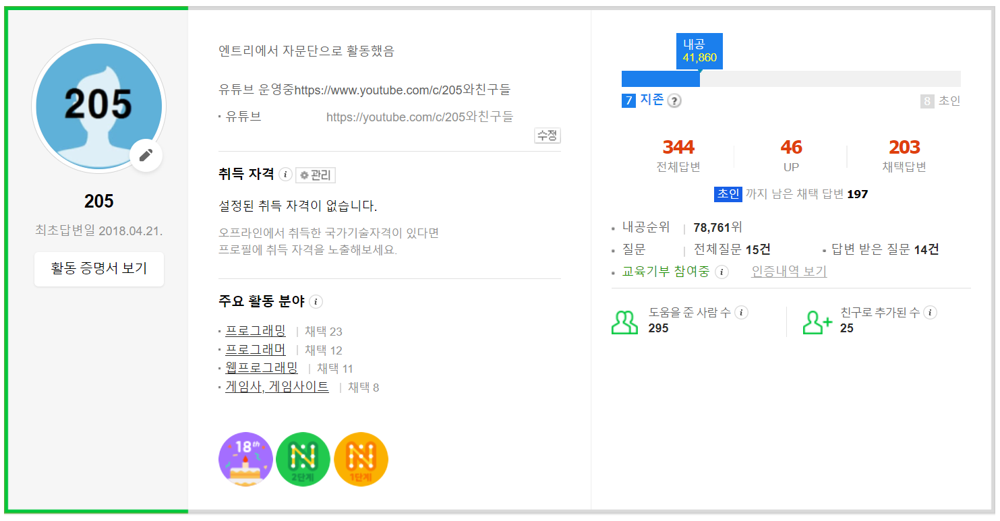

네이버 지식IN에서 프로그래밍 관련 답변 활동을 했습니다.

중학교 때 처음 접한 Entry 블록 코딩을 하면 언제나 시간 가는 줄 모르고 정말 재미있게 공부했습니다. 그런데 가끔 코딩을 하다가 막히면 벽에 갇힌 느낌이 들 때가 있었으며, 하나하나 찾아보며 문제 해결을 하다 보니 시간도 많이 걸렸습니다. 학교/학원 생활을 하면서 충분히 시간을 낼 수 없었을 때 인터넷 검색에 있는 답변들에서 많은 도움을 받은 경험이 있었습니다.

저도 도움이 되고 싶어서 다른 사람들에게 틈틈이 올라오는 질문에 답변을 올리다 보니 어느덧 **영웅 레벨**에 달성했습니다.

- 활동 인증: https://kin.naver.com/popup/activityCert.nhn?u=E%2F8vjC4YT0Bv5S2Tm6zkqCrdF%2FiAVaUiALEGDZaiF80%3D

