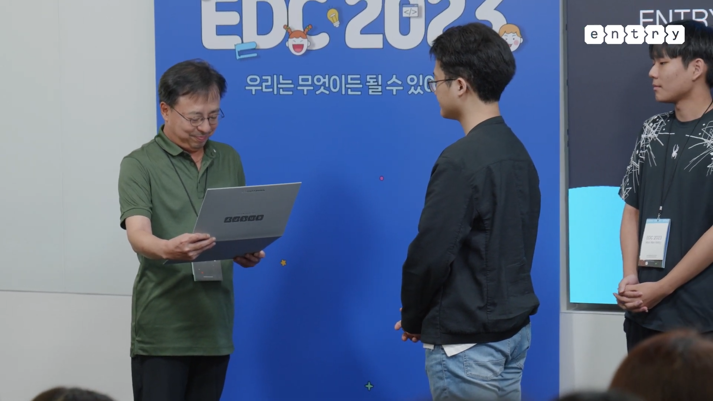
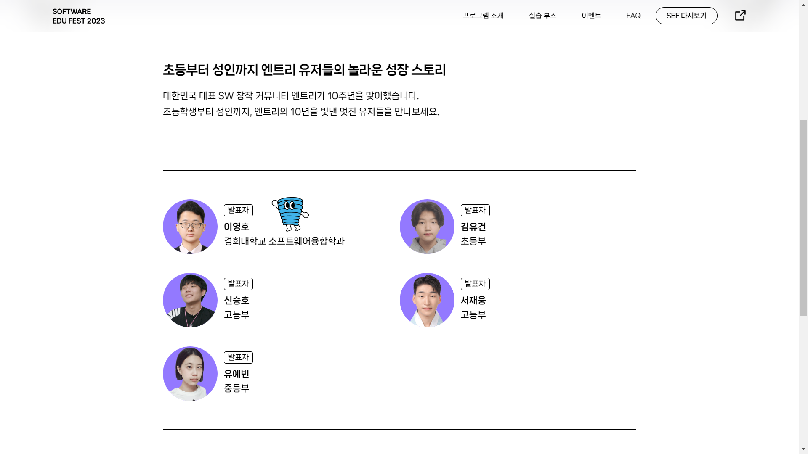
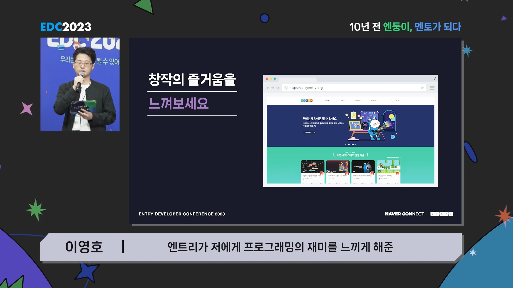
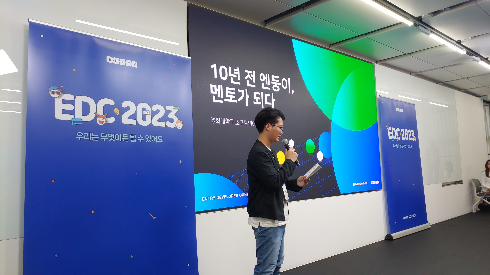
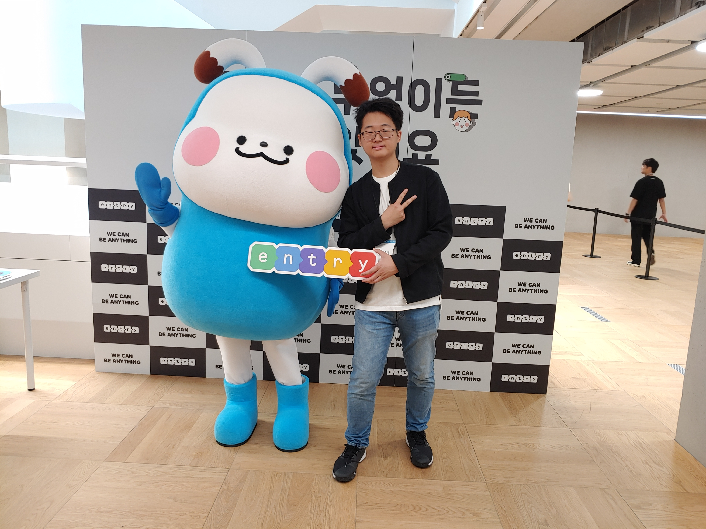

네이버 SEF(소프트웨어 교육 페스티벌)에서 엔트리 10주년을 기념하여 열린 EDC(엔트리 개발자 컨퍼런스)에서 발표자로 참여했습니다.

엔트리가 10년 동안 발전하고 저도 엔트리를 이용하며 성장한 10년간의 스토리를 발표하고 왔습니다.

## 링크

- 발표 영상: https://youtu.be/5mXDyEdVn4E
- 행사 스케치: https://youtu.be/lvllpmkN-sc
- SEF2023 사이트: https://sef.connect.or.kr/2023

