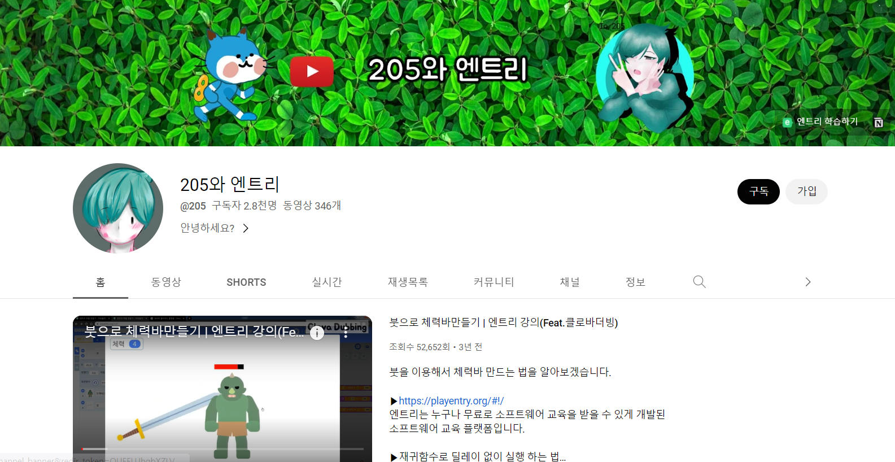
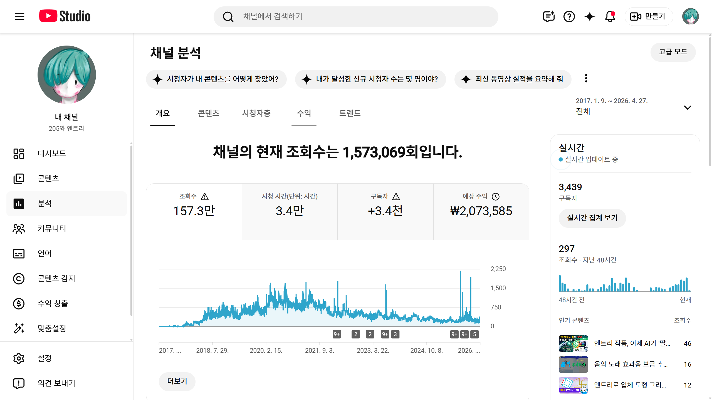
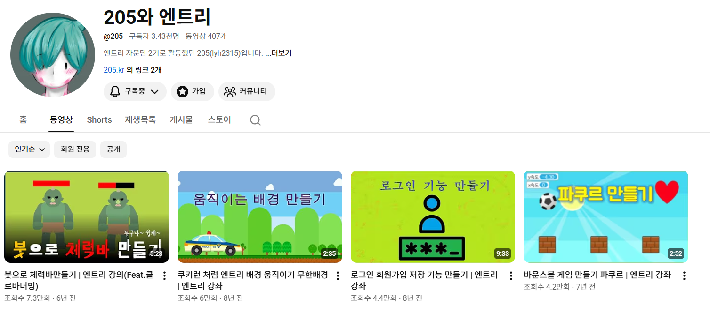

엔트리 코딩 강좌 유튜브 ["205와 엔트리"](https://www.youtube.com/c/205%EC%99%80%EC%B9%9C%EA%B5%AC%EB%93%A4) 채널을 운영하고 있습니다.

2017년에 엔트리 코딩 강좌 유튜브를 처음 개설했습니다. 당시에는 엔트리 관련 교육 자료가 충분하지 않아 엔트리 관련 지식을 공유하고자 강의 영상을 제작하였습니다.

- 엔트리 프로그래밍 방법 강의
- 엔트리 Q&A 운영
- 엔트리 기능 업데이트 공유

강좌를 준비하면서 프로그래밍 지식 체계화에 도움이 되었습니다.

## 콘텐츠 종류

- **엔트리 강좌**: 일반적인 엔트리 강좌와 다르게 엔트리의 기본 개념을 설명하는 것이 아니라, 랭킹 만드는 법, 붓 렌더링으로 체력바 만드는 법, 저장 기능 만드는 법 등 자신의 엔트리 작품에 적용해서 응용해 볼 수 있을 만한 주제로 영상을 만듭니다.
- **엔트리 팁**: 엔트리의 기본 개념이나 엔트리 사이트를 더 잘 이용하기 위한 팁을 설명합니다.
- **엔트리 소식**: 엔트리의 업데이트 소식이나 이벤트 소식 등을 전달합니다.
- **엔트리 게임**: 엔트리로 만들어진 게임들을 플레이하고 리뷰합니다. 종종 코드를 살펴보고 개선점을 설명하거나 잘 만들어진 점을 소개하기도 합니다.

---

## 첨부 자료

