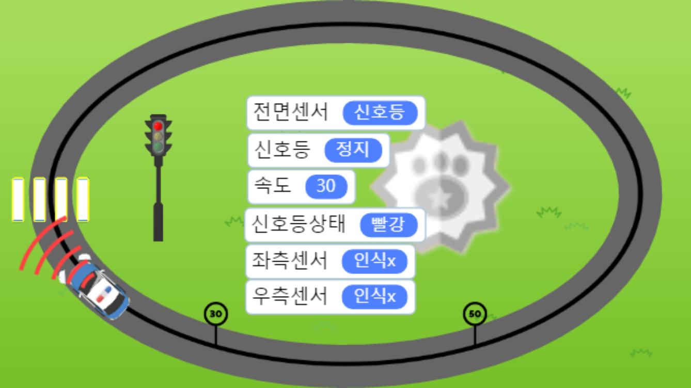

엔트리 「[4주년 공모전](https://post.naver.com/viewer/postView.nhn?volumeNo=14835207&memberNo=25082732)」 **내가이등이드론상** 수상.

- 수상작: [자율주행 자동차](http://naver.me/GlNv53ty)
- 공모전 안내(추가): https://naver.me/5budWKb5

## 작품 설명

**제작 의도**
"자율주행자동차"란 운전자 또는 승객의 조작 없이 자동차 스스로 운행이 가능한 자동차를 말합니다.
사람의 실수로 발생하는 교통사고를 없애고, 차를 타고 있으면서 운전에 쏟을 힘과 집중력으로 차 안에서 다른 것들을 할 수 있게 하기 위하여 만들었습니다.

## 작품 사용 방법 (자율주행 자동차 기능)

- **자동차 자율주행 기능**: 자율주행자동차가 인식하는 전용도로가 있고, 좌/우 2개의 센서로 전용도로를 인식하여 경로를 따라 주행합니다.
- **속도 변환 기능**: 30km/h와 50km/h 속도 표지판이 있고, 통과할 때 해당 속도로 자동 변환되어 주행합니다.
- **신호등 인지 기능**: 빨간불은 멈추고 초록불은 주행합니다. 차가 멈추었을 때 노랑불이면 출발하지 않지만, 주행 중에 노랑불이면 계속 주행합니다.
- **돌발상황(행인의 무단 횡단)**: 자동차 앞에 행인이 무단횡단하는 것이 인지되면 자동으로 멈추고 경보를 울립니다.

---

## 첨부 자료

**PDF**

- [이영호님_확인서.pdf](이영호님_확인서.pdf)

