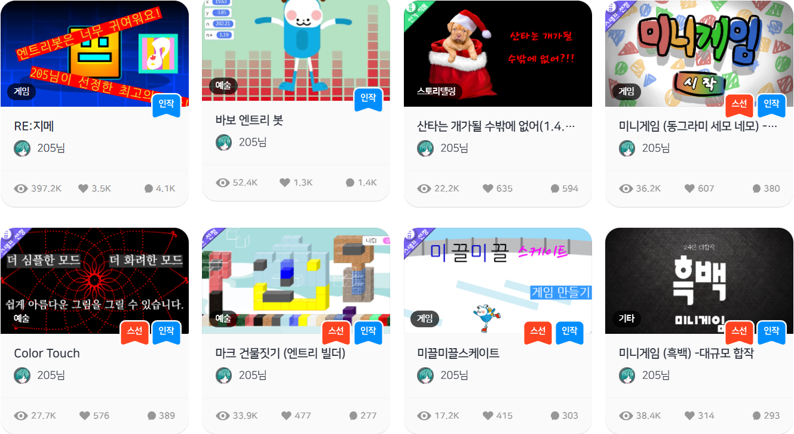

> 스태프 선정은 엔트리로 만들어진 다채롭고 뛰어난 작품을 소개하기 위해
> 운영자(스태프)가 특별히 선정해, 첫 페이지에서 표시하는 작품을 말합니다.

## 엔트리 스태프 선정 작품 수 20개로 1위 입니다.

> 계정별 분포: **205 계정 16개 + 205선생님 계정 3개 + 그 외 1개 = 총 20개**

또한 **엔트리 작품 중 최초로 조회수 100,000을 달성**한 기록이 있습니다.

1. [미니게임 (파쿠르) - 대규모 합작](https://playentry.org/project/677b9344ccf1ebf11665e38c)
2. [미니게임 (흑백) - 대규모 합작](https://playentry.org/project/63031a048101a101d5c42614)
3. [미니게임 (동그라미 세모 네모) - 대규모 합작](https://playentry.org/project/5e4794bae95026002eb1a0a3)
4. [\[스선\]한글시계](https://playentry.org/project/5a4b7517ee46ced3ada87eaf)
5. [미끌미끌스케이트](https://playentry.org/project/598c23a28c73b41d074b0e4d)
6. [진격의 공(100%펜)](https://playentry.org/project/5955e830a895cb07ec0ec101)
7. [Color Touch](https://playentry.org/project/5943ea9ba9f6680a4ddb6cc1)
8. [앨리스(205게임즈6)](https://playentry.org/project/579cabd5a55c2b0965d11ba8)
9. [마크 건물짓기 (엔트리 빌더)](https://playentry.org/project/5795dee78fbf11f126ea1a34)
10. [가상채팅(학습형 인공지능)2](https://playentry.org/project/56ee774cc5e9d38232cf9492)
11. [미사일을 피하여라4편](https://playentry.org/project/56c84aa1ead7469f3f782596)
12. [3D.](https://playentry.org/project/569f57818601e87e2b2d73d7)
13. [보물 훔치기](https://playentry.org/project/568653e9bbbce542602ea616)
14. [사각형 키우기](https://playentry.org/project/5669694ec5e84d854101cbc1)
15. [사람만들기](https://playentry.org/project/566388d36d07f5d13f623480)
16. [스트레스 해소블럭을 부셔라!!!(205게임즈5)](https://playentry.org/project/56233cc1c7806c7c3fc96910)
17. [픽셀 그림판(48x27)](https://playentry.org/project/58c3def077c0ef821bfb6bad)
18. [\[코딩게임왕\]런!](https://playentry.org/project/58aecf796052508e07eba5fe)
19. [\[코딩게임왕\]3D 런](https://playentry.org/project/58a6765d57e32c7c25d7aa65)
20. [한글 출력기\[3d\]](https://playentry.org/project/5b1ca734883cd07a689a38cb)

---

## 첨부 자료

