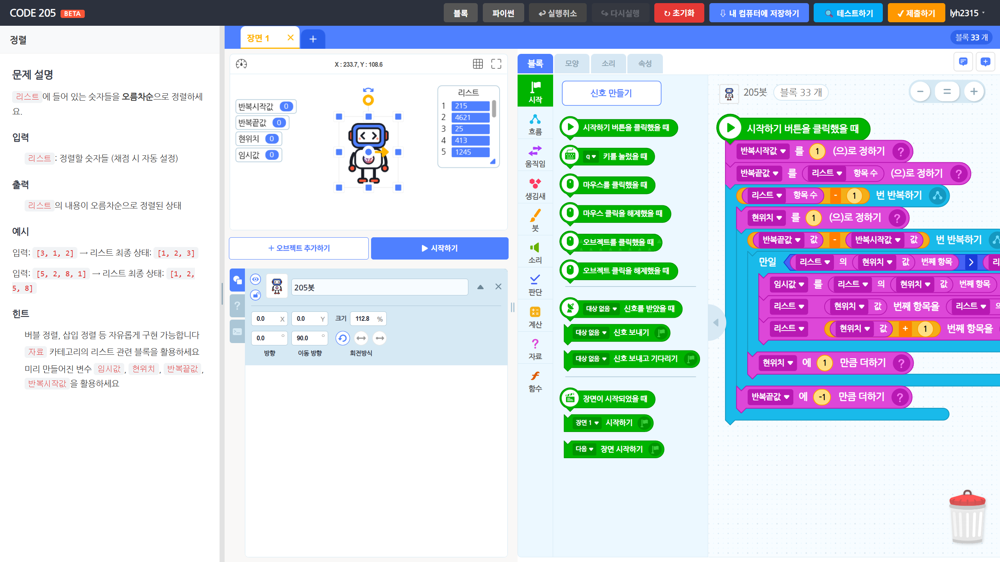

블록 코딩 기반 알고리즘 문제 풀이 플랫폼입니다. 좌측 패널에서 문제 지문을 읽고, 우측 에디터로 블록을 조립하여 풀이합니다. 제출 시 **브라우저에서 테스트 케이스를 자동 채점**합니다.

> **상표**: "205"®는 대한민국 특허청에 출원된 등록 상표입니다 (출원번호 40-2023-0165693).
> **Attribution**: 이 프로젝트는 [entrylabs/entryjs](https://github.com/entrylabs/entryjs) (Apache 2.0)를 런타임 엔진으로 사용합니다. Entry Labs의 공식 서비스가 아닙니다.

## 화면 구성

### 메인 화면

- 문제 목록을 카드로 표시, 난이도를 별(0~5)로 표시
- 해결한 문제는 초록 테두리 + "✓ 해결" 배지로 구분
- 상단 "학습 시작하기" 영역에 sample / tutorial 카테고리 노출
- 난이도·해결 여부 필터 패널, localStorage에 상태 보존
- 헤더: 비로그인 시 "로그인 / 가입", 로그인 시 닉네임 드롭다운

### 에디터 화면

- 좌측: 문제 설명 패널 (Markdown 렌더링, 드래그로 크기 조절)
- 우측: 엔트리 블록 코딩 워크스페이스 + 스테이지
- 상단 헤더: 블록/파이썬 모드 전환, 실행취소/다시실행, 초기화, 내 컴퓨터에 저장하기, 테스트/제출, 사용자 드롭다운
- 풀었던 문제 재진입 시 "이전에 푼 코드를 불러오시겠어요?" 확인 모달

### 회원 페이지

- `/signup.html` — 가입 폼 (아이디·비밀번호·출생연도 필수, 14세 이상)
- `/login.html` — 로그인 폼
- `/profile.html` — 4개 섹션:
  1. 기본 정보 (이메일·표시이름 변경)
  2. 풀이 통계 (총 N/M + 난이도별 그리드)
  3. 내가 푼 코드 (자동 저장된 정답 목록)
  4. 비밀번호 변경
  5. 풀이 데이터 초기화 (solved + 코드 일괄 삭제)
  6. 계정 삭제 (CASCADE로 모든 회원 데이터 정리)

### 정적 페이지

- `/contribute.html` — 문제 기여 가이드
- `/privacy.html` — 개인정보 처리방침
- `/terms.html` — 이용약관

## 회원 시스템 (선택)

- **비회원으로도 핵심 기능 그대로 이용 가능** — 회원 가입은 추가 가치(서버 동기화·코드 보관·통계)를 위한 선택
- 가입 정책: username 영문·숫자·_ 3~20자, 비밀번호 8자 이상 + 영문 + 숫자, 14세 이상
- **비밀번호는 bcrypt(cost 10) 해시로만 저장.** 평문 미보관, 운영자도 조회 불가. 분실 시 복구 미제공
- 세션 쿠키 `code205.sid` — `httpOnly` + `sameSite=lax` + `secure`(HTTPS) + 7일
- Rate-limit (IP 기준): login 10회/15분, signup 5회/1시간
- 가입 폼에 "엔트리(playentry.org) 계정과 다른 비밀번호 사용" 강조 안내

## 풀이 기록 동기화 (회원)

- 정답 통과 시 `problem_id`가 서버 `solutions` 테이블에 자동 등록
- 페이지 로드 시 localStorage(`entry:solved`) ↔ 서버 양방향 자동 병합
- 비회원은 기존대로 localStorage만 사용 (강제 로그인 X)

---

## 첨부 자료

