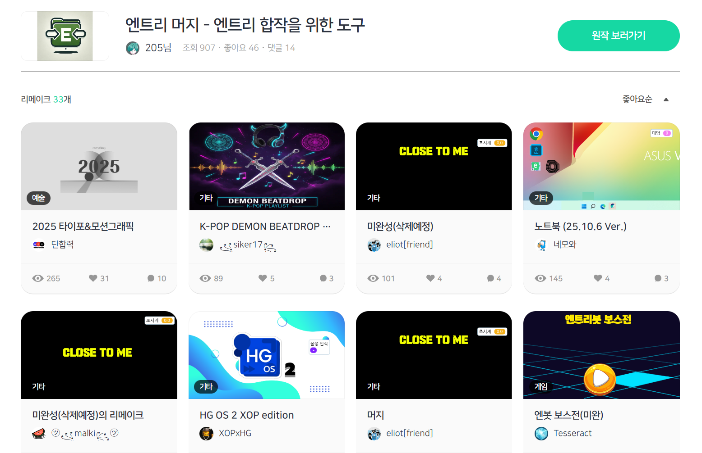
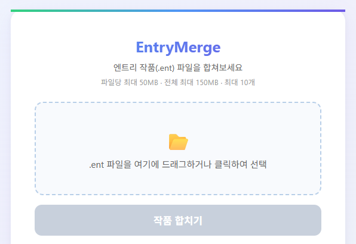
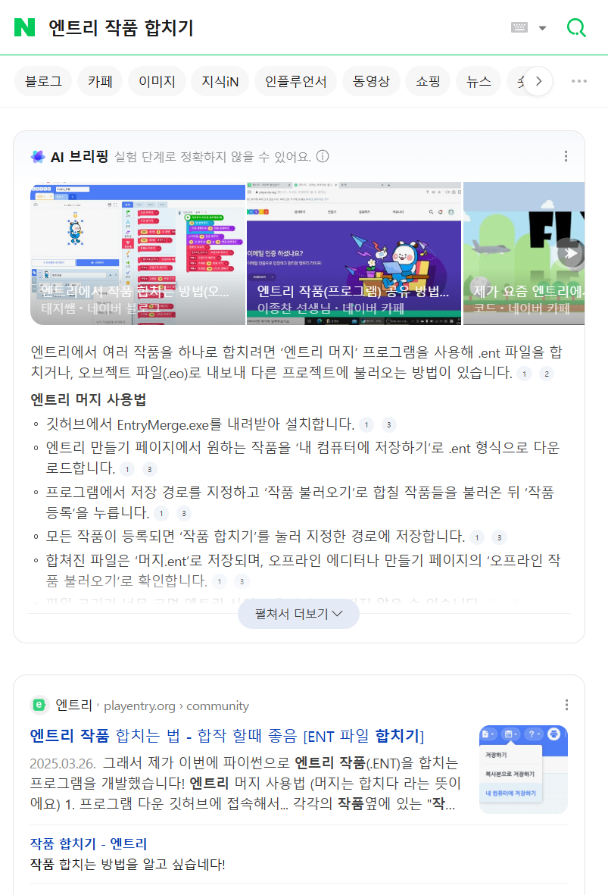

> 🔥 **엔트리 프로젝트 파일 (.ent)을 합치는 프로그램을 개발했습니다.**

- 웹 URL: <http://entry.205.kr>
- 네이버 검색 시 상단에 노출되고 있습니다.

파이썬으로 tar 압축을 풀고 json 방식으로 저장된 코드를 잘 합쳐서 하나의 프로젝트 파일로 생성합니다.

## 활용

많은 프로젝트들이 저의 "엔트리 머지"로 개발되어 공유되고 있습니다.

- 머지로 만든 작품 보기: https://playentry.org/remakes/678b8711133715065e4548c7?sort=likeCnt
- 영상: https://www.youtube.com/watch?v=OSB-FyKwbHM

## 웹 서버 버전

인기가 많아 다운로드 없이 사이트에서 바로 작품 합치기를 할 수 있도록 개발했습니다. (Render 사용)

- 깃허브 (Python 원본): <https://github.com/205sla/EntryMerge-python>
- 깃허브 (웹 서버): <https://github.com/205sla/EntryMergeServer>
- 크롬 확장 버전은 [엔트리-merge-크롬-확장](../엔트리-merge-크롬-확장/) 참고

---

## 첨부 자료

