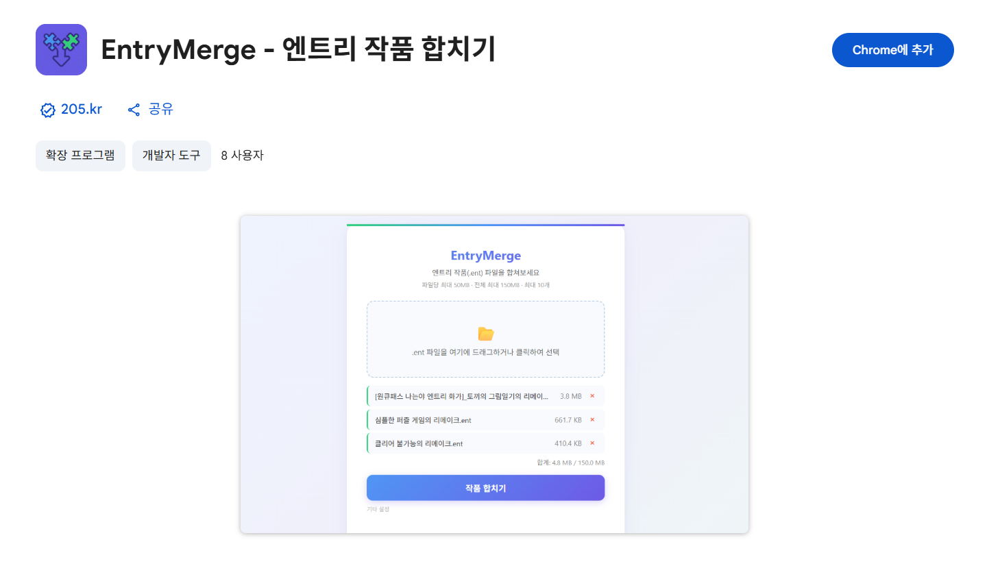

엔트리(Entry) 작품의 변수·리스트 데이터를 브라우저에 **저장·복원**하고, **다른 작품의 세이브까지 불러올 수 있게** 해 주는 크롬 확장 프로그램입니다.

작품 내부에서 이름이 `@`로 시작하는 변수·리스트만 추적하며, 모든 데이터는 사용자의 브라우저 localStorage에만 보관됩니다. **외부 서버로 전송되는 정보는 없습니다.**

## 주요 기능



### 자동 불러오기

작품이 실행(`run`) 상태로 전환되는 즉시 이전에 저장된 데이터를 자동 복원합니다.

### 수동 저장 — `@저장` 함수

작품 안에서 `@저장` 함수를 호출하는 순간, `@` 접두사가 붙은 모든 변수·리스트가 localStorage에 저장됩니다.

### 교차 작품 불러오기 — `@가져오기` 함수 (v1.2.0~)

다른 작품에 저장된 세이브 데이터를 현재 작품으로 가져올 수 있습니다. 시리즈 작품 1편의 엔딩 데이터를 2편에서 이어받는 시나리오 등에 활용 가능.

```
@가져오기 [69b3ef8e0075070c7c1d0aca]   ← 다른 작품의 project ID
```

### 확장 설치 감지 — `@확장프로그램` 변수

확장이 활성화된 상태에서 작품을 실행하면 `@확장프로그램` 변수가 자동으로 `1`로 세팅됩니다. 작품 안에서 "세이브 기능은 확장을 켜야 사용 가능합니다" 같은 안내를 조건부로 표시할 수 있습니다.

### 데이터 관리 팝업

확장 아이콘 클릭 시 나타나는 팝업에서 **현재 작품 데이터 초기화** / **모든 작품 데이터 초기화**를 지원합니다.

## 안전성 / 개인정보

- 추적 대상은 **`@` 접두사 변수/리스트**에 한정
- 로드 시 **primitive 타입(number·string·boolean) 검증** — 변조된 객체·함수 주입 차단
- 손상된 JSON은 항목별로 스킵하고 나머지는 정상 복원
- 대상 프로젝트 ID는 hex 패턴 검증 후 접근
- 모든 데이터는 **기기 내부(localStorage)** 에만 저장
