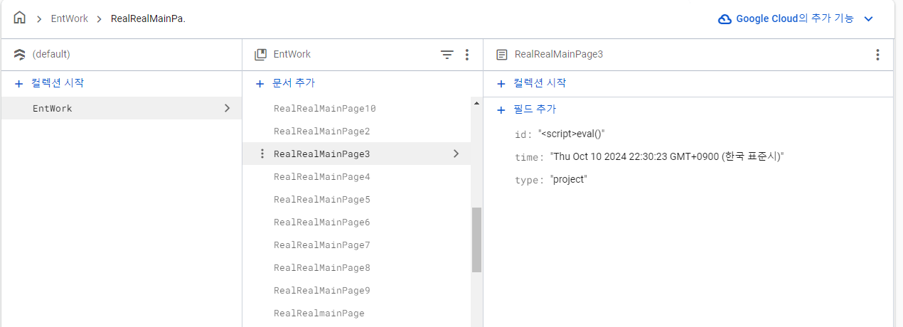
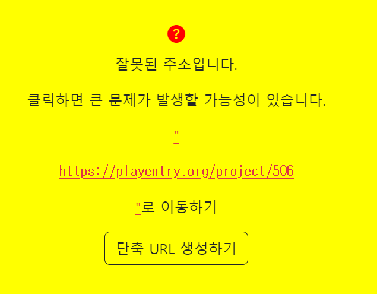
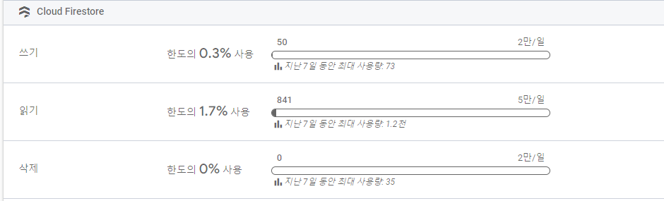
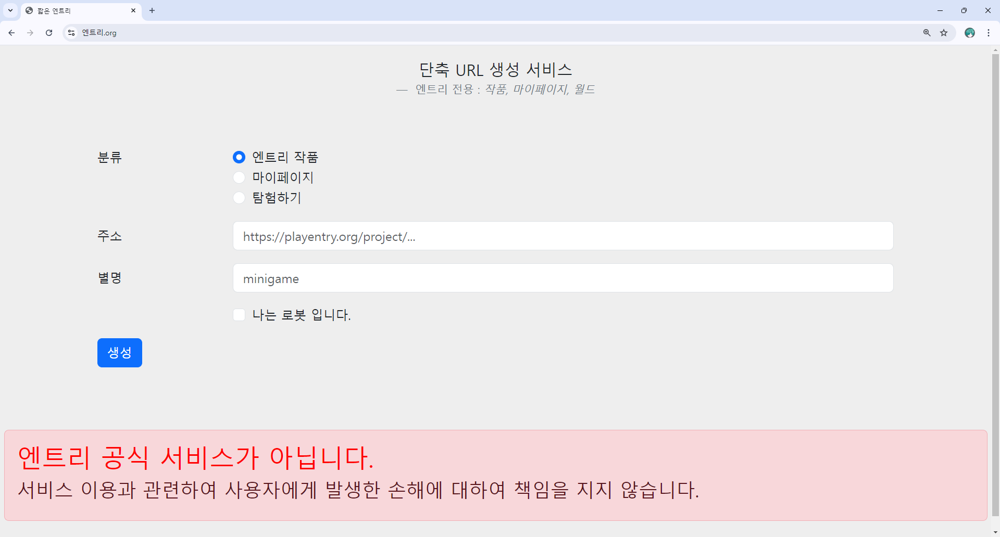

> 엔트리의 작품, 프로필, 탐험하기 등의 URL을 단축하는 서비스

## 기능 설명

- 사용자에게 링크와 별명을 입력
- 파이어 베이스의 저장 공간 파이어 스토어에 저장
- [엔트리.org/"별명"](http://엔트리.org) 형식으로 접속 시 링크 연결



## 도메인 / 링크

- **운영 도메인**: <https://xn--oy2b95t44j.org/> (한글로 「엔트리.org」 — 본인 보유)
- 깃허브: <https://github.com/205sla/ShortENT>



## 개발 일지

파이어 베이스를 빠르게 사용해 보고 싶어서 가장 간단한 서비스인 단축 URL 서비스를 만들었습니다.


### 엔트리 전용

```javascript
// 정규식: 알파벳과 숫자만 허용
const regex = /^[a-zA-Z0-9]{20,30}$/;
const regexN = /^[a-zA-Z0-9]{1,30}$/;
const regexP = /^(https?:\/\/)?playentry\.org\/project\/[a-zA-Z0-9]{20,30}$/;
const regexM = /^(https?:\/\/)?playentry\.org\/profile\/[a-zA-Z0-9]{20,30}$/;
const regexW = /^(https?:\/\/)?space\.playentry\.org\/world\/[a-zA-Z0-9]{20,30}$/;
```



보안상의 이유로 엔트리 관련 URL만 단축할 수 있도록 만들었습니다. 엔트리 특성상 어린아이들이 많이 사용하는데 [엔트리.org](http://엔트리.org) 도메인을 사용하기 때문에 의심 없이 접속할 가능성이 높기 때문입니다.

### 프로젝트 ID만 저장

```javascript
if (projectType == "project") {
    GoUrl = 'https://playentry.org/project/' + projectId;
} else if (projectType == "profile") {
    GoUrl = 'https://playentry.org/profile/' + projectId;
} else if (projectType == "world") {
    GoUrl = 'https://space.playentry.org/world/' + projectId;
}



if (GoUrl == '') {
    // 없는 주소
    $('#loadURL').hide();
    $('#errorShow').fadeIn();
    $('#errorTXT').html("타입 오류");
} else {
    // 글자수와 정규식 확인
    if (regex.test(projectId)) {
        // 단축 URL 이동
        $('#loadURL').hide();
        $('#moveURL').show();
        window.location.href = GoUrl;
    }
}
```

엔트리의 프로젝트(작품) 주소는 `https://playentry.org/project/{프로젝트 ID}` 형태입니다. 따라서 링크 전체를 저장하는 방식이 아닌 링크의 종류(작품, 개인 페이지, 월드)와 ID만 저장하는 방식을 사용했습니다.

다만 로컬에서 주소가 정상인지를 처리하기 때문에 정상적이지 않은 주소를 등록하는 경우가 있었습니다.

### 파이어 베이스 규칙 수정

```javascript
rules_version = '2';


service cloud.firestore {
  match /databases/{database}/documents {
    match /EntWork/{document} {
      allow read: if true;

      allow update: if false;
      allow delete: if false;

      allow create: if request.resource.data.keys().hasAll(['id']) &&
                    request.resource.data.id is string &&
                    request.resource.data.id.matches('^[a-zA-Z0-9]+$');
    }
  }
}
```

파이어 베이스 규칙을 수정해서 저장된 id 값이 이상이 없을 때만 저장할 수 있도록 수정했습니다.

### 링크 연결할 때도 확인

```javascript
if (regex.test(projectId)) {
    // 단축 URL 이동
} else {
    // 이상한 URL
    $('#loadURL').hide();
    $('#strangerURL').fadeIn();
    $('.mainC').css('background', '#FFFF00');
    $('#stranger').html('<a class="link-danger" href="' + GoUrl + '">"<xmp>' + GoUrl + '</xmp>"</a>로 이동하기');
}
```

서버에 다음과 같은 데이터를 적용해서 사용자에게는 정상적인 URL인 것처럼 표시하는 경우가 있어서

```html
<script>eval(atob(`bG9jYXRpb24uaHJlZj0iaHR0cHM6Ly9wbGF5ZW50cnkub3JnL3NpZ25vdXQi`))</script>
```

`<xmp>` 태그를 추가했습니다.

### 악성 코드 분석

```javascript
atob() // Base64로 인코딩된 데이터를 원래의 문자열 형태로 변환합니다.
eval() // 문자열로 표현된 JavaScript 코드를 실행합니다.
```

`bG9jYXRpb24uaHJlZj0iaHR0cHM6Ly9wbGF5ZW50cnkub3JnL3NpZ25vdXQi` 라는 문자열을 디코딩 하면 아래와 같은 코드가 나옵니다.

```javascript
location.href = "https://playentery.org/signout"
```

단축 URL을 통해 들어가면 로그아웃되는 코드입니다.

## 소감

엔트리 전용 단축 URL이라는 정말 간단한 서비스인데도 공개 하루 만에 이러한 공격이 들어오는 것이 신기했습니다. 뭔가 웹사이트에 올릴 때는 항상 보안에 신경 써야겠습니다.

추가로 한글날 기념으로 한글 도메인을 사용하여 단축 URL 서비스를 만들었는데 반응이 상당히 좋아서 기분이 좋았습니다. ([엔트리.org](http://엔트리.org) 링크가 엔트리 이야기에서 사용되고 있는 모습)
