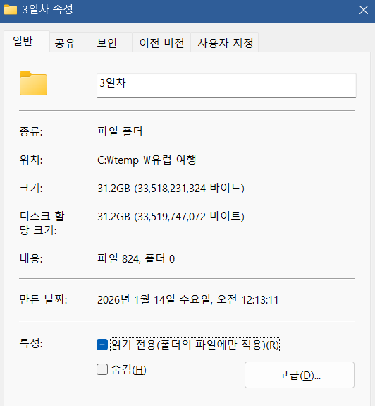
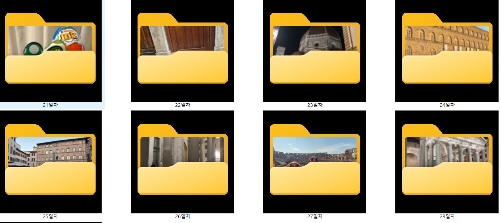
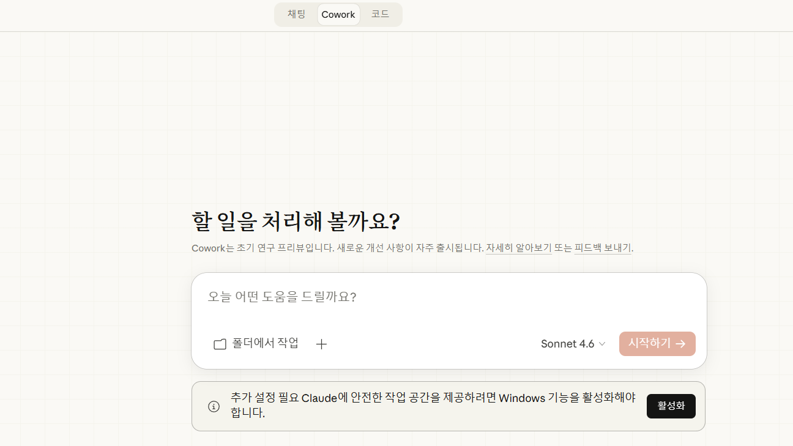
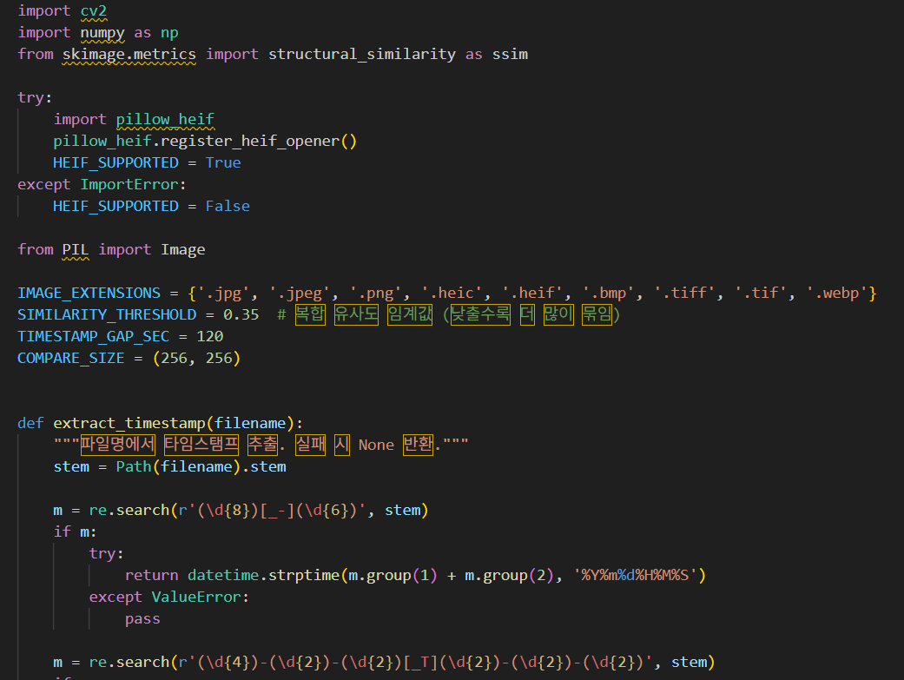
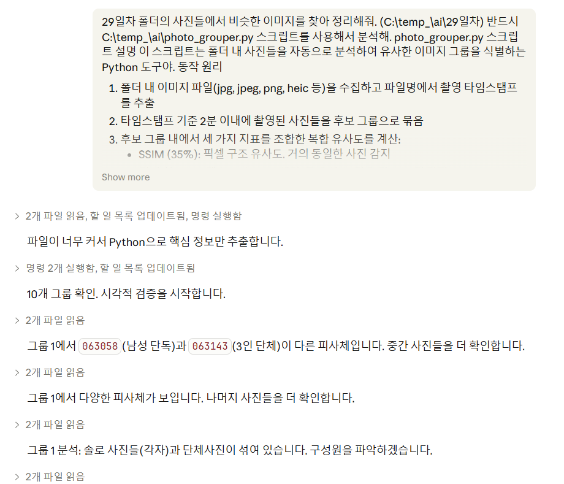
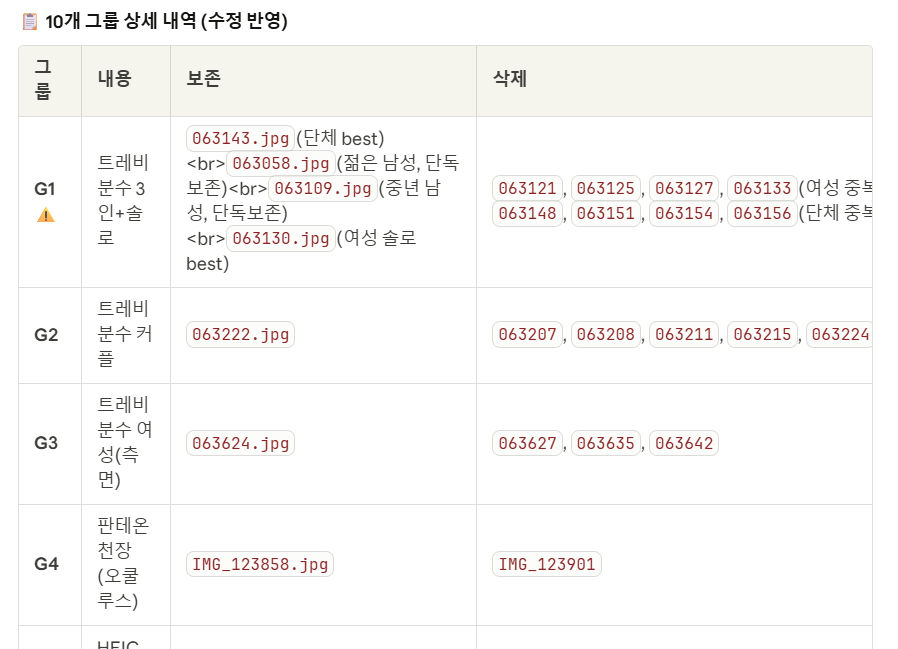
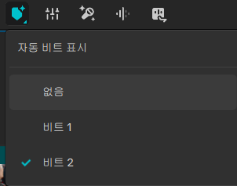
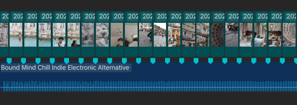
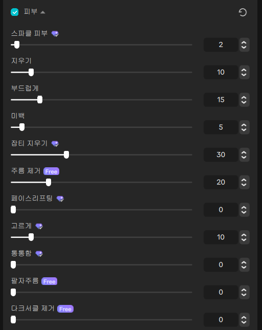

# 효율적으로 슬라이드쇼 형식의 영상 제작

> 🔥 2025년 8월 가족 여행으로 29일간의 유럽 여행을 다녀왔다.
> 하루에 찍은 사진이 많은 날에는 1000개가 넘기도 하는 상황에서 어떻게 효율적으로 영상을 만들 수 있을까?

## 날짜 별 사진 분류

일부 기기에서는 현지 시간으로 기록되고 일부 기기에서는 한국 시간으로 시간이 기록되어 이를 현지 시간으로 통일하고 각 사진을 폴더별로 나눴다.

이 과정은 좀 느리지만 윈도우 기본 검색 기능으로도 충분히 가능해서 직접 진행했다.

## 잘 찍은 사진만 남기기

1일차와 2일차는 시간이 좀 걸리긴 하지만 충분히 수작업으로 비슷한 사진을 지우는게 가능했다.

하지만 3일차의 경우 친절한 가이드분이 **사진을 모두 연사로 찍어주셔서 비슷한 사진을 지우고 베스트 샷만 남기는게 너무 오래 걸렸다.**

마침 그때 친구의 추천으로 **클로드 웍스**를 알게 되어 적용해 보았다. 다만 아쉽게도 윈도우 환경에서는 **클로드 코드**만 사용 가능해서 클로드 코드를 이용하기로 하였다.

## 문제 정의

클로드 코드는 정말 비싸다. 3만원짜리 유료 요금제를 사용해도 가장 성능 좋은 모델을 5번 정도 호출하면 제한이 걸린다.

**따라서 모든 사진을 클로드가 분석하는 건 불가능하다.**

비슷한 사진들은 비슷한 시간대에 촬영되고 사진의 유사도는 파이썬 라이브러리로 쉽게 구분할 수 있다는 점을 이용해서, 우선 비슷한 이미지를 파이썬으로 묶어주는 프로그램을 (클로드로) 개발했다.

### `photo_grouper.py` — 동작 원리

1. 폴더 내 이미지 파일(jpg, jpeg, png, heic 등)을 수집하고 파일명에서 촬영 타임스탬프를 추출
2. 타임스탬프 기준 **2분 이내**에 촬영된 사진들을 후보 그룹으로 묶음
3. 후보 그룹 내에서 **세 가지 지표를 조합한 복합 유사도** 계산:
   - **SSIM (35%)** — 픽셀 구조 유사도. 거의 동일한 사진 감지
   - **컬러 히스토그램 (30%)** — HSV 색감/톤 유사도. 같은 장소/조명 감지
   - **ORB 특징점 매칭 (35%)** — 구도/구성 유사도. 비슷한 포즈/배치 감지
4. 복합 유사도 ≥ 0.35 인 사진들을 **Union-Find로 클러스터링**
5. 각 클러스터에서 **품질 점수**(선명도 50% + 노출 30% + 해상도 20%)가 가장 높은 사진을 best로 선택
6. 삭제 대상 사진과 동명의 `.MOV` 파일(아이폰 라이브포토)이 있으면 함께 삭제 대상으로 표시

(전체 코드와 클로드 호출 프롬프트는 노션 원본 페이지의 토글에서 확인 가능)

## 클로드 호출 워크플로우

1. **스크립트 실행** — `python photo_grouper.py <폴더>` (timeout ≥ 600s)
2. **결과 파싱** — JSON으로 groups / singles / summary
3. **시각적 검증** — 각 그룹 사진을 Read 도구로 직접 확인, best 선택 검증
4. **결과 보고** — 사용자에게 그룹·삭제 목록 보고 후 승인 대기
5. **삭제 실행** — 승인 후 `os.remove`로 처리

29일치 사진을 자동으로 정리해서 쉽게 베스트 샷만 남기고 정리할 수 있었다.

## 영상 만들기 — 캡컷

영상 제작에는 **캡컷**을 사용했고, **비트 마커** 기능이 아주 유용했다. 음악 파일 위에 사진을 놓고 단축키로 음악 비트에 맞게 사진이 넘어가는 영상을 쉽게 만들 수 있었다.

캡컷의 **피부 보정 기능**도 생각보다 성능이 좋아서, 사진에는 적용하지 않고 오즈모 포켓으로 촬영한 영상에만 적용했다.

## 완성

이렇게 생각보다 빠르게 유럽 여행 영상을 제작할 수 있었다.
