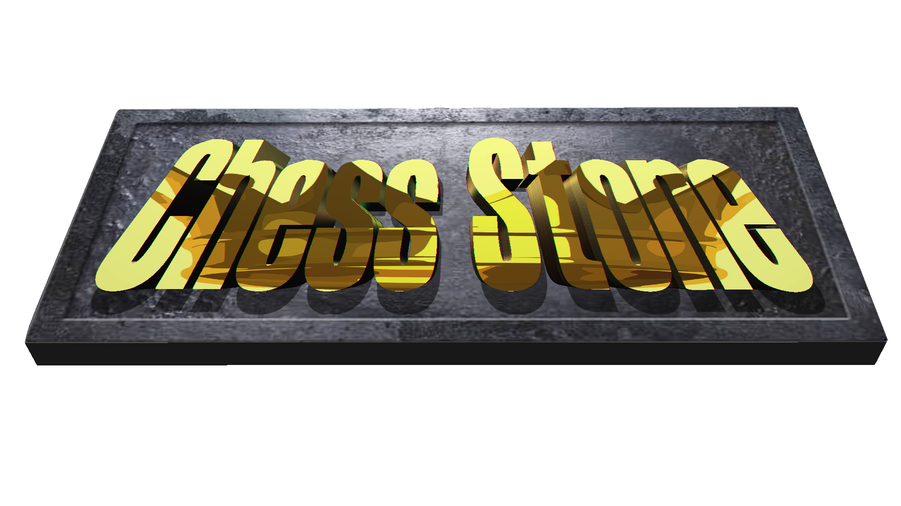
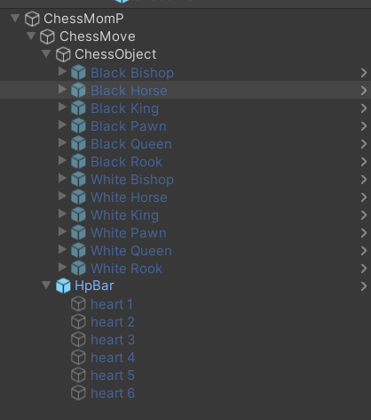
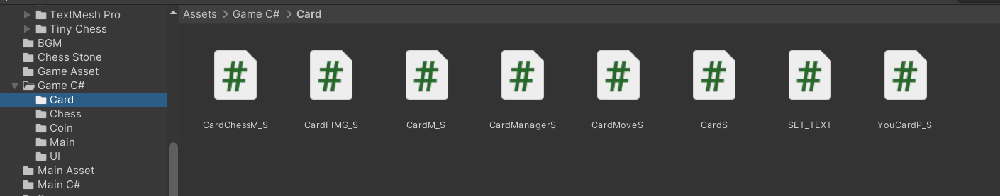
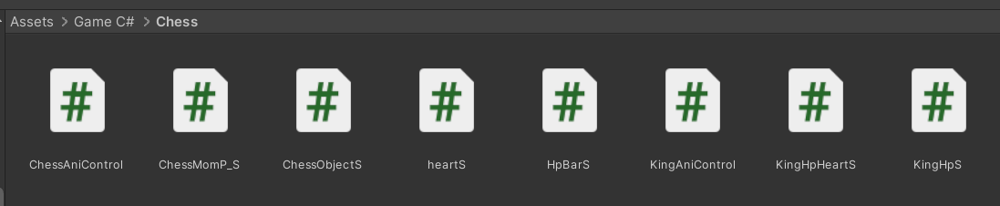
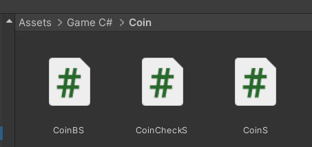
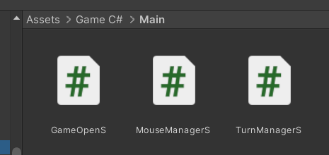
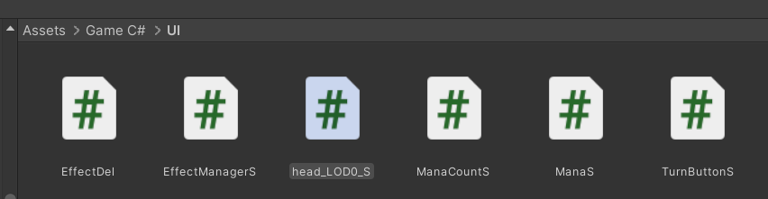
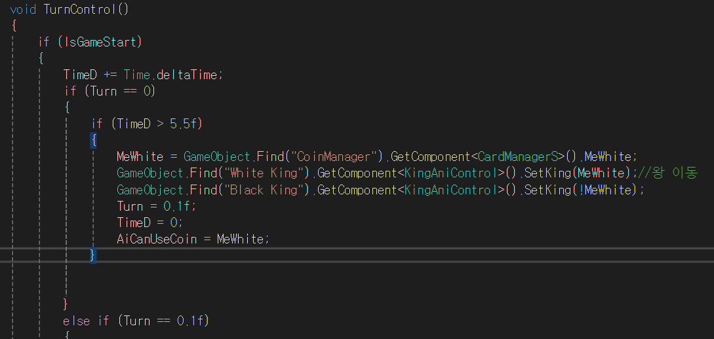
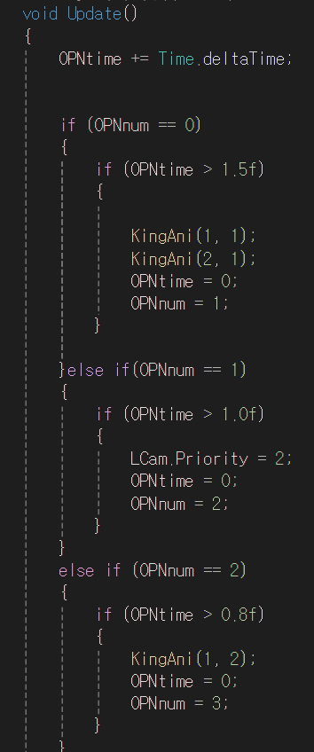
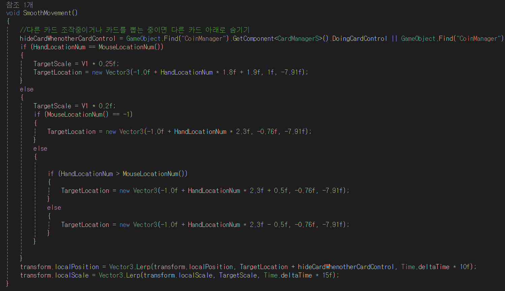

> 놀랄 만큼 쉽고 믿기 힘들 만큼 재미있습니다.

- 홍보 영상: https://youtu.be/7DBrfa5C2FI
- 실행 영상: https://youtu.be/IBJccQO2sMg
- 플레이(안드로이드): https://play.google.com/store/apps/details?id=com.lyh205.ChessStone&pli=1

## 개발 일지

> 💡 처음으로 본격적으로 개발한 유니티 게임 입니다. 대학교 1학년 2학기 학기말 과제로 제작하였습니다.
> 하스스톤의 [체스경기](https://namu.wiki/w/%ED%95%98%EC%8A%A4%EC%8A%A4%ED%86%A4/%EC%84%A0%EC%88%A0%EC%A7%91%20%EB%82%9C%ED%88%AC/%EC%B2%B4%EC%8A%A4%20%EA%B2%BD%EA%B8%B0)를 모티브로 제작하였으며 주요 전력으로는 **대각선 행마**가 있으며 필드내의 유닛이 상대와 홀수 짝수가 맞지 않을 경우 배열히 비틀어져 앞에 존재하는 두 유닛 모두에게 공격할 수 있습니다.

### 처음 유니티 게임 개발을 하며 했던 실수들

하나의 클래스에서는 하나의 역할만 해야한다는 생각에 사로잡혀 굳이 나누지 않아도 될 코드를 나눠 버렸습니다.

### 500줄이 넘는 함수 하나

`Coroutine`이라는게 존재하는 지 몰랐기 때문에 `Update()`에서 `deltaTime`을 누적하여 하나하나 계산해서 동작하도록 코드를 만들었습니다.

(전체 `TurnControl()` 함수 코드는 노션 원본 페이지의 토글 블록에서 확인할 수 있습니다.)

### 오프닝 애니메이션

오프닝 애니메이션도 정말 한땀 한땀 열심히 만들었었습니다.

### 카드 이동

카드가 이동하는 부분도 순수 좌표 계산으로 만들었었습니다.

### 카드 구현

카드 안에 모든 유닛 프리팹을 넣어두고 해당하는 카드에 활성화 하는 방식으로 구현했었습니다.

> 💡 그래도 AI의 도움 하나 없이 어떻게든 알고 있는 지식으로 게임을 완성했었기 때문에 저에겐 뜻 깊은 프로젝트 입니다. 하하…
> 그래도 코루틴 만이라도 알고 있었으면 좀더 쉽게 게임을 만들 수 있었지 않았을까 하는 생각이 남습니다.

---

- 개인정보 처리방침: https://www.notion.so/b7ec0d6bdeb54bc1b915dc818705d555
