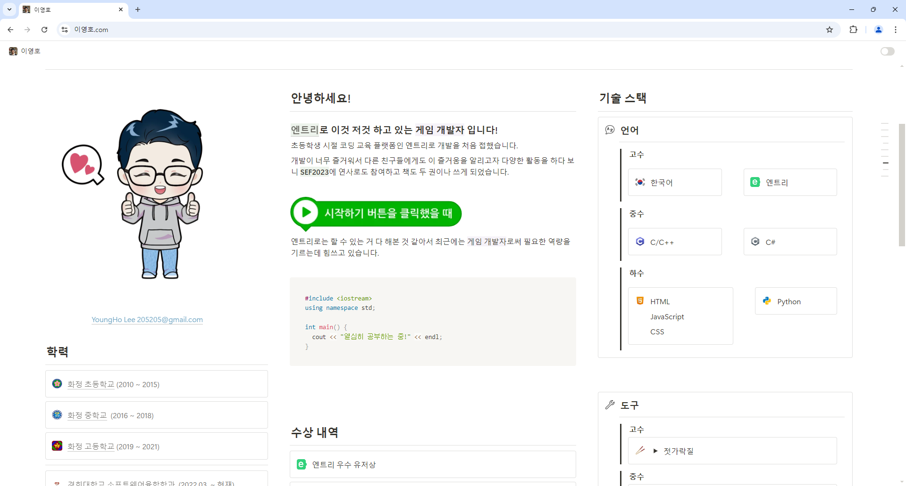

> 개인 포트폴리오 사이트

노션에 도메인을 연결하기 위해서는 매달 10달러의 비용이 발생하기 때문에 노션 페이지 뷰어 사이트를 제작했었으나 노션 정책 변경으로 막히며 [이영호.com](http://이영호.com)에 접속 시 노션 페이지로 이동하도록 만들었습니다.

이 과정에서 [Puuush](https://puuu.sh/)를 이용해서 관리자에게 알림을 보내도록 만들었습니다.

## 개발 일지

### 고대디에서 도메인 구매

고대디에서 [이영호.com](http://이영호.com) 도메인을 구매했습니다.

### 네임서버 설정

클라우드 플레어에 회원가입 하고 [이영호.com](http://이영호.com)에 접속하면 클라우드 플레어로 연결되게 하기 위해서 네임서버를 변경합니다.

### 노션 뷰어 기능 개발

**Cloudflare Workers** 기능을 이용해서 알림을 보내고 노션 페이지로 이동합니다.

```javascript
addEventListener('fetch', event => {
  event.respondWith(handleRequest(event.request));
});

async function handleRequest(request) {
  const url = new URL(request.url);

  if (url.hostname === 'xn--vj5bn0ab83a.com') {
    const redirectUrl = `https://205sla.notion.site${url.pathname}${url.search}`;

    await sendNotification(url);

    return Response.redirect(redirectUrl, 301);
  }

  return fetch(request);
}

async function sendNotification(url) {
  const yourEndpoint = '********';

  const notificationData = {
    title: 'hello',
    body: `go:${url.pathname}${url.search}`
  };
  console.log(`Notification body: go:${url.pathname}${url.search}`);

  const response = await fetch(`https://puuu.sh/notify/${yourEndpoint}`, {
    method: 'POST',
    headers: {
      'Content-Type': 'application/json'
    },
    body: JSON.stringify(notificationData)
  });

  if (!response.ok) {
    console.error('Failed to send notification:', response.statusText);
  }
}
```

> 노션 정책 변경으로 현재는 동작하지 않음


---

## 첨부 자료




